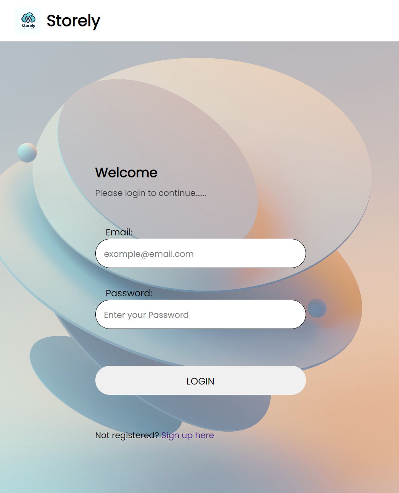

# Storely: Secure Cloud File Storage System

## Introduction
**Storely** is a robust cloud storage service tailored to provide secure, flexible, and user-friendly solutions for managing digital files. Whether you're a professional, student, or part of a small to medium enterprise, Storely offers an exceptional file management experience from anywhere in the world.

## Features
- **User Authentication:** Secure login and sign-up with OTP verification.
- **File Management:** Upload, manage, and access your files securely.
- **Progressive Web App (PWA):** Installable on any device for a seamless user experience.
- **Robust Security:** Including password hashing, session management, and OTP verification.

## User Interface
Here are some highlights of our user interface:

### Login Page

### Signup Page

### Dashboard: File Management

## System Design
Storely leverages modern technologies to ensure high security and performance:
- **Backend:** Node.js with Express
- **Frontend:** HTML, CSS
- **Security:** OAuth 2.0, bcrypt for hashing, express-session for session management
- **Cloud Infrastructure:** Deployed on Google Compute Engine, using Redis for efficient data management

### How does it work?

## Usage
After installation, open your browser and go to `http://localhost:3000` to start using Storely.

